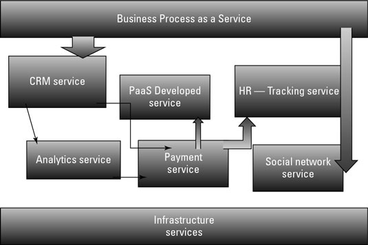

# Proses Bisnis Sebagai Layanan (BPaaS)

**Proses Bisnis Sebagai Layanan (BPaaS)** adalah jenis proses bisnis horizontal atau vertikal yang disampaikan berdasarkan model layanan awan. Layanan awan ini - yang mencakup Perangkat Lunak sebagai Layanan (SaaS), Platform sebagai Layanan (PaaS), dan Infrastruktur sebagai Layanan (IaaS) - oleh karena itu bergantung pada layanan terkait.

Perusahaan telah mengotomatisasi proses bisnis selama beberapa dekade. Awalnya, mereka terpaksa melakukannya secara manual atau pemrograman. Misalnya, jika perusahaan ingin memastikan bahwa sistem manajemen untuk pesanan mendongak cek kredit sebelum mengeluarkan transaksi, perusahaan membuat permintaan itu ke dalam sebuah program.

 
Dalam beberapa kasus, seluruh proses bisnis perusahaan outsourcing dapat menerapkan proses secara manual atau melalui otomasi. Dengan dimulainya komputasi awan, pendekatan ini mulai berubah. Semakin banyak perusahaan melihat pendekatan layanan yang berorientasi pada layanan. Alih-alih menganggap Anda memerlukan aplikasi paket yang mencakup logika bisnis, data, dan proses, mungkin saja Anda memilih aplikasi proses yang tidak terkait dengan satu aplikasi.

 
Ada alasan praktis untuk memilih layanan proses bisnis. Pertama, organisasi dapat memilih proses yang sesuai dengan kebijakan bisnis. Ini kemudian dapat digunakan di banyak lingkungan aplikasi yang berbeda. Ini memastikan bahwa proses yang konsisten dan pasti, yang konsisten ada di seluruh organisasi. Misalnya, perusahaan mungkin memiliki proses yang kompleks untuk memproses gaji atau mengelola pengiriman. Layanan ini dapat dihubungkan ke layanan lain di awan, seperti SaaS, dan juga aplikasi di pusat data.

 
Seperti layanan awan SaaS, proses bisnis mulai dirancang sebagai penawaran kemasan yang dapat digunakan dengan cara hibrida. Bagaimanapun, proses bisnis adalah langkah yang Anda ambil atau aktivitas yang Anda lakukan untuk memfasilitasi penyampaian produk atau layanan kepada pelanggan atau pemangku kepentingan Anda. Proses bisnis ini benar-benar bisa menjadi layanan yang bisa dilakukan secara otomatis, termasuk mengelola e-mail, mengirimkan paket, atau mengelola kredit pelanggan.

Perbedaan antara aplikasi kemasan tradisional dan BPaaS adalah bahwa BPaaS dirancang untuk berorientasi pada layanan. Jadi, BPaaS cenderung memiliki antarmuka yang terdefinisi dengan baik. Selain itu, BPaaS adalah layanan standar untuk digunakan oleh banyak organisasi yang berbeda. Karena layanan ini jauh lebih optimal untuk memberikan layanan secara konsisten, mereka dapat memanfaatkan otomasi, standarisasi, dan pengulangan dalam cara layanan digunakan dan dikirimkan.

Karakteristik berikut menentukan BPAaS:

BPaaS duduk di atas tiga layanan awan pendiri lainnya: SaaS, PaaS, dan IaaS.

Layanan BPaaS dapat dikonfigurasi berdasarkan proses yang sedang dirancang.

Layanan BPaaS harus memiliki API yang terdefinisi dengan baik sehingga mudah dihubungkan ke layanan terkait.

BPaaS harus dapat mendukung banyak bahasa dan beberapa lingkungan penerapan karena bisnis tidak dapat memprediksi bagaimana proses bisnis akan dimanfaatkan di masa depan.

Lingkungan BPaaS harus bisa menangani skala besar. Layanan harus bisa pergi dari pengelolaan beberapa proses untuk beberapa pelanggan untuk dapat mendukung ratusan bahkan ribuan pelanggan dan proses. Layanan ini mencapai tujuan tersebut dengan mengoptimalkan layanan awan yang mendasari untuk mendukung jenis elastisitas dan penskalaan ini.

# Contoh BPaaS
## gtFinansi

**gtFinance** adalah software untuk mempermudah pengelolaan anggaran, keuangan dan akuntansi di perusahaan. Fitur meliputi pengaturan anggaran (budget control), dimulai dari proses perencanaan, pencatatan penggunaan anggaran hingga pelacakan penggunaan anggaran (budget tracking). Software ini dilengkapi dengan fitur penjurnalan otomatis yang akan dapat mempermudah beban kerja akuntan dan bagian keuangan. Terakhir adalah laporan (standar laporan keuangan) dapat dikumpulkan dan ditampilkan dengan lebih cepat dan akurat.
gtEnterprise Finance dibangun dengan tujuan untuk mempermudah pemilik atau pengelola perusahaan dalam mengalokasikan dan mengontrol anggaran, mengetahui dengan tepat kondisi keuangan perusahaan yang pada akhirnya dapat mengambil keputusan yang tepat berbasis data-data yang disajikan  tersebut.

**Keuntungan**
* Support multicurrency & virtual account
Semua proses transaksi keuangan dan approval tercatat dengan rapi, konsisten, dan terkodifikasi berdasarkan jenis transaksinya.
* Sistem memiliki klasifikasi transaksi keuangan sehingga memudahkan pengelolaan beberapa jenis transaksi dalam perusahaan. Contoh: Untuk pengelolaan transaksi pengeluaran, dapat menggunakan BKK, CA, Pembelian (PO). Sedangkan pengelolaan transaksi pemasukan dapat menggunakan BKM dan Penjualan.
* Bukti berkas transaksi dapat disimpan dalam sistem, sehingga mengurangi angka kehilangan salinan berkas hardcopy transaksi.
* Sistem mampu mengeluarkan cetak faktur penjualan, invoice, kuitansi, buku hutang, buku piutang.
* Pengguna dapat mengelola pemasukan, pengeluaran hutang dan juga piutang perusahaan.
* Tidak ada limitasi jumlah transaksi yang dapat disimpan ke dalam sistem.
* Tidak ada limitasi jumlah akun yang dapat disimpan ke dalam sistem.
* Setiap transaksi yang dicatat dalam sistem selalu tercatat jejaknya (timestamp dan pelaku insert tercatat dalam sistem).
* Adanya pengaturan skenario jurnal membuat seluruh jurnal yang generate dari sistem sudah sesuai dan berpadanan langsung dengan transaksi.
* Auto-journaling, sehingga dapat mempermudah beban kerja akuntan dan bagian keuangan.
* Dengan adanya proses sekali posting untuk seluruh Laporan keuangan, maka pengguna tidak perlu menghitung posisi keuangan secara manual per laporan.
* Sistem mampu mengeluarkan output laporan keuangan standar dan juga versi cetak (PDF dan Excel) untuk kepentingan administratif pelaporan dan audit perusahaan.