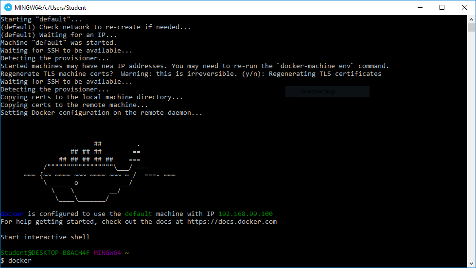
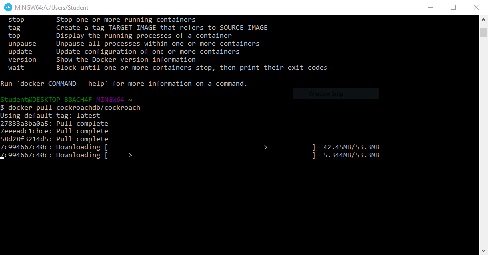
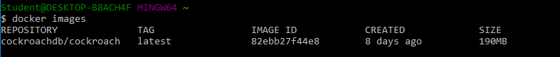
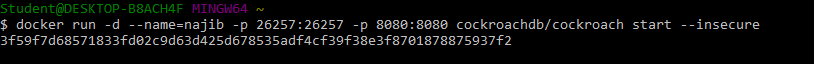
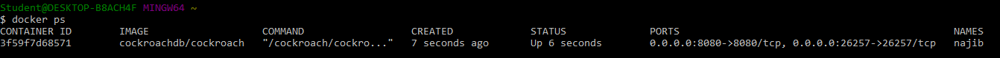

# Minggu ke-5 
**Install Cockroachdb**
1. Buka docker quickstart

2. download docker cockroachdb

3. Install docker image menjadi container

**konfigurasi**

**Buat database**

**Buat table**

**Isi data**

**Query data**

**Referensi**

https://vladmihalcea.com/how-to-get-started-with-cockroachdb/