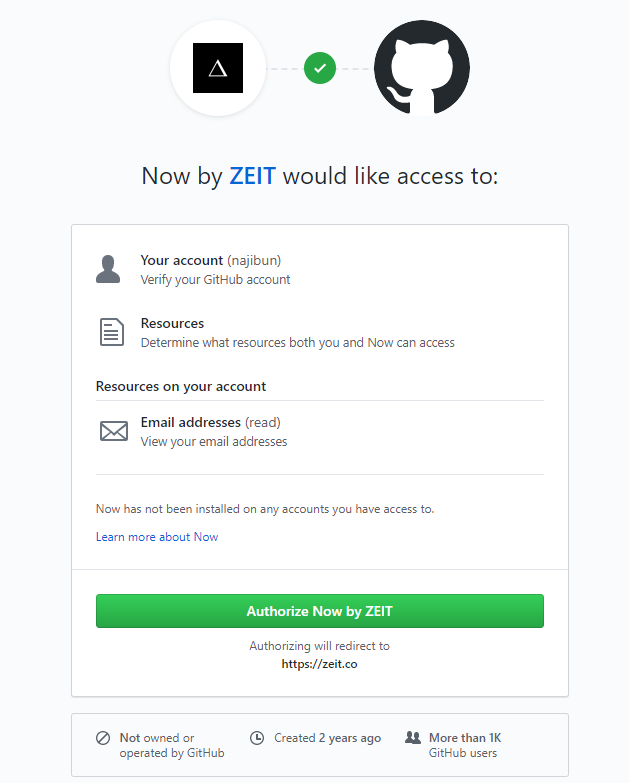

# Pertemuan Minggu ke 07

## Belajar Zeit
1. Daftar di zeit.co  




2. Install node.js  
https://nodejs.org/en/download/

3. Install now-cli dengan npm   
Buka powershell admin / bash lalu ketik berikut
```
PS C:\Windows\system32> npm i -g now

> now@16.4.0 preinstall C:\Users\Student\AppData\Roaming\npm\node_modules\now
> node ./scripts/preinstall.js

C:\Users\Student\AppData\Roaming\npm\now -> C:\Users\Student\AppData\Roaming\npm\node_modules\now\dist\index.js
+ now@16.4.0
added 1 package in 18.577s
PS C:\Windows\system32>
```
4. Buka bash baru  
lalu `now login "emailygdidaftarkan"`
```
Student@DESKTOP-B8ACH4F MINGW64 ~/Desktop
$ now login kang.najiib@gmail.com
- Sending you an email
> We sent an email to kang.najiib@gmail.com. Please follow the steps provided
  inside it and make sure the security code matches Fancy Thorny Devil.
- Waiting for your confirmation
√ Email confirmed
> Congratulations! You are now logged in. In order to deploy something, run `now`.
```
jangan lupa confirm email yg masuk dari zeit.co

5.  membuat project baru next.js dengan npm
```
$ npm init next-app my-next-project
npx: installed 1 in 2.607s
Creating a new Next.js app in C:\Users\Student\Desktop\my-next-project.

Installing react, react-dom, and next using npm...


> core-js@2.6.10 postinstall C:\Users\Student\Desktop\my-next-project\node_modules\core-js
> node postinstall || echo "ignore"

+ react@16.10.2
+ react-dom@16.10.2
+ next@9.1.1
added 754 packages from 357 contributors and audited 10230 packages in 262.178s
found 0 vulnerabilities


Success! Created my-next-project at C:\Users\Student\Desktop\my-next-project
Inside that directory, you can run several commands:

  npm run dev
    Starts the development server.

  npm run build
    Builds the app for production.

  npm start
    Runs the built app in production mode.

We suggest that you begin by typing:

  cd my-next-project
  npm run dev
```

6. Deploy next-project dengan now

```
Student@DESKTOP-B8ACH4F MINGW64 ~/Desktop
$ cd my-next-project/

Student@DESKTOP-B8ACH4F MINGW64 ~/Desktop/my-next-project
$ now
> Deploying ~\Desktop\my-next-project under najibun
> Using project my-next-project
> NOTE: This is the first deployment in the my-next-project project. It will be promoted to production.
> NOTE: To deploy to production in the future, run `now --prod`.
https://my-next-project-pcteh8gkk.now.sh- Building...
- Finalizing...
> Ready! Deployed to https://my-next-project.najibun.now.sh [in clipboard] [29s]
```

Hasilnya bisa dilihat di sini https://my-next-project.najibun.now.sh