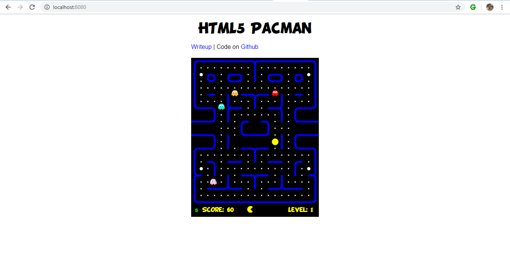
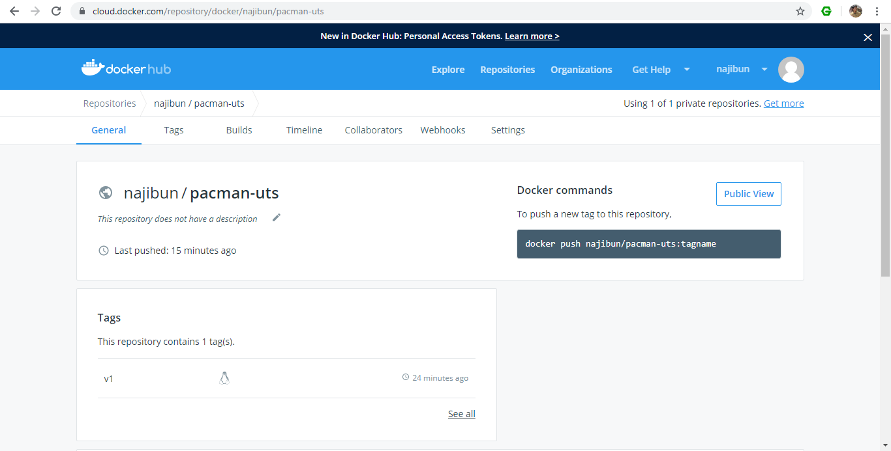

# TUGAS UTS  
## Muhammad Najib 175410171  

1. Download aplikasi yang ingin kita buat.  
```
$ git clone https://github.com/daleharvey/pacman.git
Cloning into 'pacman'...
remote: Enumerating objects: 51, done.
remote: Total 51 (delta 0), reused 0 (delta 0), pack-reused 51
Unpacking objects: 100% (51/51), done.
```
2.  Pada folder yang sama buatlah sebuah file dengan nama **Dockerfile** isikan dengan berikut.
```
FROM nginx:alpine
COPY ./pacman /usr/share/nginx/html
```
3.  Membuat image dari **Dockerfile** 
```
$ docker build -t najibun/pacman-uts:v1 .
Sending build context to Docker daemon  857.6kB
Step 1/2 : FROM nginx:alpine
 ---> b6753551581f
Step 2/2 : COPY ./pacman /usr/share/nginx/html
 ---> 84794b843ba4
Successfully built 84794b843ba4
Successfully tagged najibun/pacman-uts:v1
```
4. Melihat image yang kita buat
```
$ docker images
REPOSITORY              TAG                 IMAGE ID            CREATED                                                                                                                             SIZE
najibun/pacman-uts      v1                  84794b843ba4        21 seconds ago                                                                                                                      22.1MB
nginx                   alpine              b6753551581f        5 days ago                                                                                                                          21.4MB
```
5. Menjalankan image menjadi container
```
$ docker run -d -p 8080:80 --name=pacman-najib najibun/pacman-uts:v1
```
6. Melihat contaner yang sedang berjalan
 ```
$ docker ps
CONTAINER ID        IMAGE                   COMMAND                  CREATED             STATUS              PORTS                  NAMES
8283041a40d7        najibun/pacman-uts:v1   "nginx -g 'daemon of…"   6 seconds ago       Up 2 seconds        0.0.0.0:8080->80/tcp   pacman-najib
```
7. Saat dibuka di browser dengan port :8080   


8. Mengupload ke hub.docker.com   
Pastikan sudah memiliki akun di hub.docker.com  

9. Login ke hub.docker.com dari console anda.
```
docker login -u=najibun -p=password
```
10. Lalu upload image yang kita buat tadi.
```
$ docker push najibun/pacman-uts:v1
The push refers to repository [docker.io/najibun/pacman-uts]
94d2dd179658: Preparing
bba7d2385bc1: Preparing
77cae8ab23bf: Preparing
bba7d2385bc1: Mounted from library/nginx
77cae8ab23bf: Mounted from library/nginx
94d2dd179658: Pushed
v1: digest: sha256:0614f341a8935c636603ac9adb517fcd31f2e8f811dea976b067843292e1dc2a size: 949

```
11. Dilihat dari website hub.docker.com pada link dibawah ini   [https://cloud.docker.com/repository/docker/najibun/pacman-uts](https://cloud.docker.com/repository/docker/najibun/pacman-uts)   

